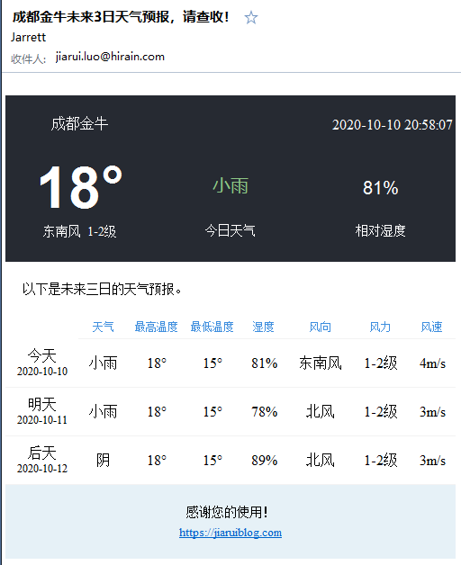

## Weather_Forecast
A weather forecast app that runs on Raspberry


更新了界面



## how to use

add a new config file named `config.json`

The example config like follows.

```json
{
  "API": {
    "key": "ac123eeb7c1***7a5ec3d322f09ff",
    "url": "https://free-api.heweather.net/s6/weather/forecast"
  },
  "SENDER": {
    "host" : "smtp.163.com",
    "username" : "***@163.com",
    "pwd" : "****"
  },
  "RECEIVER": [{
    "username":"***",
    "email": "****",
    "location": "成都"
  },
  {
    "username":"****",
    "email": "****",
    "location": "****"
  }]
}
```
then, run the app is ok.

`python app.py`

## TODO list

- timed task
- run on the Raspberry


## reference
[树莓派设置定时python任务](https://blog.csdn.net/xhmcom/article/details/90293342)